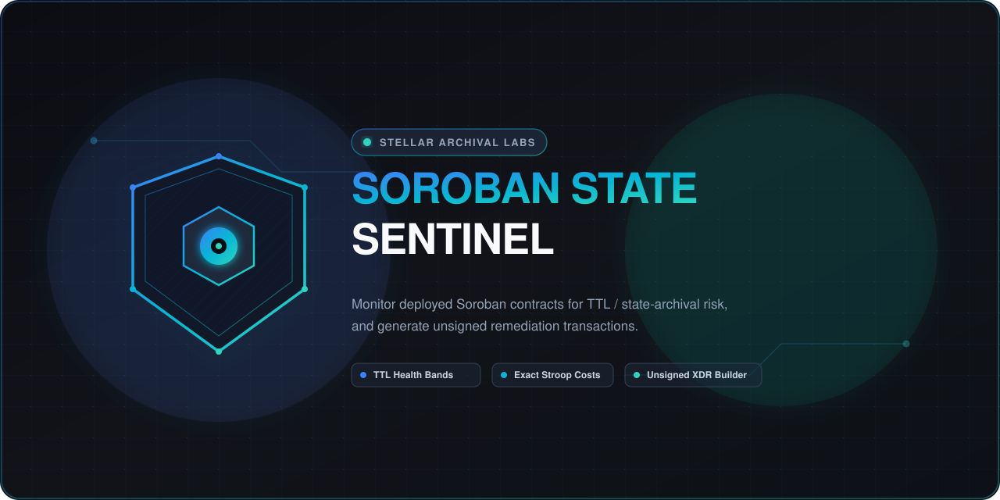

<p align="center">
  
</p>

# soroban-state-sentinel

[](https://github.com/Aycode01/soroban-state-sentinel/actions/workflows/ci.yml)
[](LICENSE)

Monitor deployed Soroban contracts for TTL / state-archival risk, and generate
the **unsigned** remediation transactions that fix it.

`soroban-state-sentinel` connects to a Soroban RPC endpoint, takes a contract id
(plus optional explicit storage keys), and reports the TTL health of every
associated ledger entry: how many ledgers remain before archival, categorized
into health bands, with an exact stroop cost to extend or restore each one.

> **Read-and-report tool with an optional unsigned-transaction-builder mode.**
> This tool never holds a private key and never signs or submits a transaction.
> It produces unsigned XDR that a human, multisig, or separately-secured keeper
> process signs and submits. There is deliberately **no signing capability
> anywhere in this repository** — see [SECURITY.md](SECURITY.md).

## Binary name

- The installed binary is **`soroban-state-sentinel`** — this is the exact
  name to shell out to (e.g. from `action-state-watch`). It is set explicitly
  in the `[[bin]]` section of `crates/cli/Cargo.toml` and matches the clap
  command name, the usage examples below, and the integration tests — not an
  accidental default.
- The **crate** is `sentinel-cli` at `crates/cli/`, named after the sibling
  crates (`sentinel-rpc-client`, `sentinel-ttl-scanner`, `sentinel-rent-model`,
  `sentinel-xdr-builder`). Build it with `cargo build -p sentinel-cli`.

## Features

- **Scan** a contract's ledger entries (instance + code + explicit storage keys)
  and classify each into a health band:
  - `healthy` — more than the healthy threshold of ledgers remaining,
  - `expiring_soon` — between the critical and healthy thresholds,
  - `critical` — at or below the critical threshold,
  - `archived` — no longer readable in the live state; needs restoration.
- **Exact stroop costs** for the two remediation actions, computed with the
  canonical fee math ported from `soroban-env-host` (see
  [`crates/rent-model/src/fees.rs`](crates/rent-model/src/fees.rs) for the
  source citation).
- **Unsigned XDR builder** for `ExtendFootprintTTLOp` / `RestoreFootprintOp`,
  batched to the live network's per-transaction footprint limits, with an
  optional complete unsigned `TransactionV1Envelope` (empty signatures) for a
  separately-held key to sign and submit.
- **`--fail-on-critical`** exit-code hook for automation (this is the
  integration point `action-state-watch` depends on — the contract is
  documented in [SCHEMA.md](SCHEMA.md)).
- **JSON / Markdown / terminal-table** output. The JSON output is a versioned
  schema (`schema_version: "1.1.0"`, see [SCHEMA.md](SCHEMA.md)).

Nothing here is hardcoded protocol data: fee rates, rent-rate denominators, TTL
bounds, resource limits, and ledger close time are read from the live network
(RPC config-setting entries, `getLatestLedger`) or supplied explicitly on the
command line, and every assumption is labeled in the output.

## Build

```bash
cargo build --release
```

The toolchain is pinned in [`rust-toolchain.toml`](rust-toolchain.toml)
(stable, edition 2021). The integration tests spawn the compiled CLI binary, so
build it before running the test suite:

```bash
cargo build -p sentinel-cli
cargo test --workspace
```

## Usage

### Scan

```bash
soroban-state-sentinel scan <contract-id> \
  [--keys <SCVAL_BASE64> ...] \
  [--durability persistent|temporary] \
  [--rpc-url https://soroban-testnet.stellar.org] \
  [--healthy-days 30] [--critical-days 7] \
  [--json | --markdown | --table] \
  [--fail-on-critical]
```

`<contract-id>` is a `C…` strkey. `--keys` values are base64-XDR-encoded
`SCVal` storage keys (repeatable). When no keys are given, the scan covers the
contract **instance** and its **code** (discovered from the instance's wasm
hash). Arbitrary persistent data keys must be supplied explicitly — see
[Limitations](#limitations).

The default output is a color-coded terminal table:

```
contract CCPYZFKEAXHHS5VVW5J45TOU7S2EODJ7TZNJIA5LKDVL3PESCES6FNCI — Test SDF Network ; September 2015 (protocol 28)
latest ledger 4566959 · ledger close 5s (default assumption) · fee_per_rent_1kb 3000 (state_size_high)

┌──────────┬──────────────┬─────────────┬──────────┬──────────────┬───────────┬───────────┬─────────────┬──────────────┐
│ id       │ kind         │ durability  │ band     │ ledgers left │ days left │ size (B)  │ extend cost │ restore cost │
...
summary: 0 healthy · 0 expiring_soon · 1 critical · 0 archived · has_critical=true
```

### Extend (unsigned XDR)

The proactive remedy for entries in the `expiring_soon` / `critical` bands,
*before* they archive:

```bash
soroban-state-sentinel extend <contract-id> \
  [--keys <SCVAL_BASE64> ...] \
  --extend-to <LEDGERS> \
  --output unsigned.xdr \
  [--source-account G…] \
  [--fee <stroops>] [--sequence <n>]
```

`--extend-to <LEDGERS>` is the number of ledgers to extend the entries' TTL
**by, measured from the current ledger** — the operation's `extendTo` field.
Stellar Core applies `liveUntilLedgerSeq = currentLedger + extendTo` (verified
against `ExtendFootprintTTLOpFrame.cpp`), so this is a duration, not an
absolute target ledger sequence. It must be at most `max_entry_ttl - 1`; the
tool validates it against the live network config before writing anything, and
rejects `0` as a no-op.

`--extend-to-days <N>` is a convenience form: N days are resolved to ledgers
using the same close-time logic `scan` uses, and the output labels the close
time as `default` (the 5s target) or `explicit` — never a silent assumption.

Output follows the `restore` conventions exactly: without `--source-account`
it writes the raw `ExtendFootprintTtl` operations, one base64-XDR per line;
with `--source-account` it writes a complete unsigned `TransactionV1Envelope`.
Exit codes `0` (success) and `2` (error) — `extend` never sets exit `1`.

### Restore (unsigned XDR)

```bash
soroban-state-sentinel restore <contract-id> \
  [--keys <SCVAL_BASE64> ...] \
  --output unsigned.xdr \
  [--source-account G…] \
  [--fee <stroops>] [--sequence <n>] \
  [--assumed-archived-entry-size 1024]
```

- **Without `--source-account`**: writes the raw `RestoreFootprint` operations,
  one base64-XDR per line.
- **With `--source-account`**: fetches the account's next sequence number from
  the ledger and writes a complete unsigned `TransactionV1Envelope` (fee
  estimated, `signatures: []`) that a separately-held key can sign and submit.

### Exit codes

| Code | Meaning |
| --- | --- |
| `0` | Success (and, with `--fail-on-critical`, no Critical/Archived entries) |
| `1` | `--fail-on-critical` triggered (some entry is Critical or Archived) |
| `2` | Usage or operational error (bad arguments, RPC failure, bad XDR, …) |

This contract is stable; see [SCHEMA.md](SCHEMA.md).

## Architecture

Five crates, each with one job:

| Crate | Responsibility |
| --- | --- |
| [`crates/rpc-client`](crates/rpc-client) | Typed JSON-RPC client: `getLedgerEntries` (batched, ≤200 keys/request), `getLatestLedger`, `getNetwork`, and live network-config / fee-rate fetch from `CONFIG_SETTING` entries. Read-only by construction. |
| [`crates/ttl-scanner`](crates/ttl-scanner) | Entry health classification: ledgers-remaining math and the `healthy` / `expiring_soon` / `critical` / `archived` bands. |
| [`crates/rent-model`](crates/rent-model) | Canonical port of `soroban-env-host`'s rent-fee computation (with source citation) plus stroop projections for extend / restore. |
| [`crates/xdr-builder`](crates/xdr-builder) | Unsigned `ExtendFootprintTtl` / `RestoreFootprint` operation builders, footprint-limit batching, TTL-key derivation, and unsigned-envelope assembly. Never touches a private key. |
| [`crates/cli`](crates/cli) | `scan` / `restore` subcommands and the json/markdown/table output. |

## Limitations

- **No trustless full-key enumeration.** Soroban RPC has no "list all storage
  keys of contract X" method. A scan covers the instance and code by default
  and any keys you pass explicitly; it cannot invent keys it cannot see.
  `action-state-watch` and other consumers must supply the persistent data keys
  they care about.
- **`fee_per_rent_1kb` is resolved, not read.** Core derives the effective rent
  fee per 1KB from its internal state-size sampling window, which RPC does not
  expose. The CLI resolves it with explicit precedence —
  `--rent-fee-per-1kb` → `--average-state-size-bytes` → the state-size-high
  plateau — and always labels which path was taken.
- **Archived entry sizes are assumed.** For `restore` (and for archived keys
  inside an `extend` footprint), the live size of an archived entry is
  unreadable over RPC; the estimate uses `--assumed-archived-entry-size`
  (default 1024 B). Core charges the actual rent at apply time and refunds the
  unused refundable fee, so a conservative estimate is safe.
- **Ledger close time.** RPC does not expose the network's *actual* average
  ledger close time; the 5-second target is the default and is always labeled
  `default` vs `explicit` in the output. Pass `--ledger-close-seconds` when you
  have a measured value.

## Contributing

See [CONTRIBUTING.md](CONTRIBUTING.md) — in particular, the porting discipline
for fee math and the rule that **no signing capability ever lands in this
repo**.

## License

Apache-2.0.

## Socials

- [Discord](https://discord.gg/pMwVZf8TX)
- [Telegram](https://t.me/+RZKO3ffLffY0NDg0)